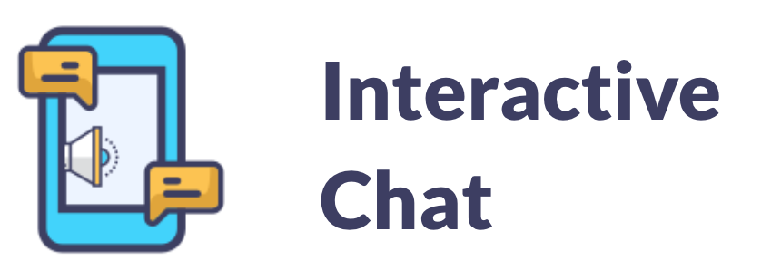
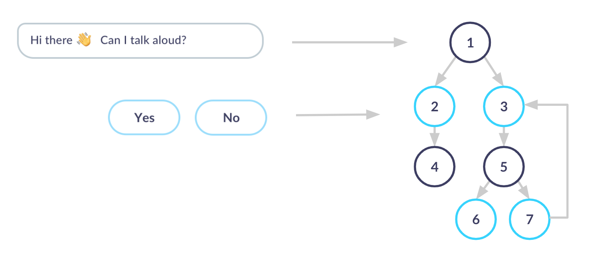
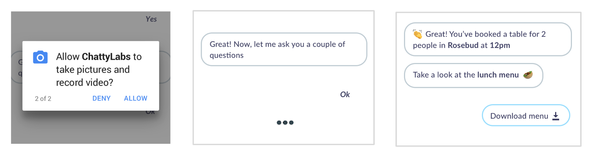

# 

|                    | TYPE  	    | VERSION 	            | STATUS 	          | COVERAGE                |
|------------------- |:-------:	    |---------------------- |-------------------- |:-----------------------:|
| `demo`             | _demo_  	    | ![Latest demo][v0]    | ![Build Status][s0] | ![Coverage Status][c0]  |
| `interactive-chat` | _library_  	| ![Latest version][v1] | ![Build Status][s1] | ![Coverage Status][c1]  |


Check: [VUI SDK](https://github.com/chattylabs/voice-user-interaction)

A component to create a conversational flow interface for mobile apps that supports interactions in both UI and Voice.



## Why choosing this library?

- Ability to create a conversational flow
- Combines voice capabilities with the UI
- Contains several Node Components ready to use 
- You can personalize the experience with your own callbacks
    
## Prerequisites
The SDK works on Android version 5.0 (Lollipop) and above. _(for lower versions [contact us](mailto:hello@chattylabs.com))_

## Dependencies

    repositories { 
        
        // Optional. Access to early versions not yet published.
        maven { url "https://dl.bintray.com/chattylabs/maven" }
    }

    dependencies {

        // Required
        implementation 'com.chattylabs.sdk.android:interactive-chat:<latest version>'
    }

## How to create a Chat flow?

The following only illustrate a *manual* way to generate and start a conversation between the app and the user.

```kotlin
val component = InteractiveChatComponent.Builder()
                        .withViewComponent(recyclerView)
                        .withVoiceComponent(voiceComponent)
                        .build()
 
with(component) {

    // Add nodes
    addNode(TextMessage.Builder("message_id_1").setText(R.string.message1).build())
    addNode(ActionText.Builder("action_ok").setText(R.string.ok).build())
    addNode(ActionText.Builder("action_ok").setText(R.string.ko).build())
    
    addNode(TextMessage.Builder("message_id_2").setText(R.string.message1).build())
    addNode(ActionText.Builder("action_one").setText(R.string.one).build())
    addNode(ActionText.Builder("action_two").setText(R.string.two).build())

    // Setup the flow
    with(prepare()) { 

        // Build the relationship
        from("message_id_1").to("action_ko", "action_ok")

        from("action_ok").to("message_id_2")

        from("message_id_2").to("action_one", "action_two")
        
        // Setup the Speech and start the flow
        setupSpeech(context, status -> start(getNode("message_id_1")))
    }
}
```

## Personalize the experience




## Wiki

Check the wiki to see how you can create your own custom [Node Components](https://github.com/chattylabs/interactive-chat/wiki/Create-a-new-Node-Component)

&nbsp;

[v0]: https://img.shields.io/badge/demo-unplished-lightgrey.svg
[v1]: https://api.bintray.com/packages/chattylabs/maven/interactive-chat/images/download.svg?label=Latest%20version

[s0]: https://app.bitrise.io/app/a780643ab1b390a6/status.svg?token=ZLtAIlkDr-NVmpKkpt1OUw&branch=master
[s1]: https://app.bitrise.io/app/a780643ab1b390a6/status.svg?token=ZLtAIlkDr-NVmpKkpt1OUw&branch=master

[c0]: https://coveralls.io/repos/chattylabs/unknown/badge.svg?branch=master&service=github
[c1]: https://coveralls.io/repos/chattylabs/interactive-chat/badge.svg?branch=master&service=github
